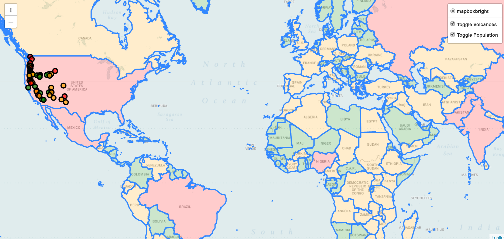

# Population-and-Volcano-Check-Webmap
This project shows a general layered map which shows the population of different countries as well as the volcanic mountains in the USA sorted by their elevation
## What Can it Do ?
This project will show you all the places in the USA which are prone to volcano with elevation level marked with different colors, users can also see the different population rates in different countries.
It is a layer controlled map and any layer can be toggeled on/off on choice.



## Installation
Use the package manager [pip](https://pip.pypa.io/en/stable/) to install pandas and folium.
### Pandas
You can find more about pandas [here](https://pandas.pydata.org/)
```bash
pip install pandas
```
### Folium 
You can find more about folium [here](https://python-visualization.github.io/folium/)
```bash
pip install folium
```
## Adding the .txt file
You add the .txt file using pandas
*import pandas first
*add the csv file
```python
import pandas
points=pandas.read_csv("scripts/filename.txt") #where points is any variable name
```
## Adding the .json file
You add the .json file using folium as we need to access its **GeoJson**
*import folium
*adding the json file which contains the geocodes
```python
import folium
folium.GeoJson(data=open("scripts/world.json",'r',encoding="utf-8-sig").read()
```
## Contributing
Pull requests are welcome. For major changes, please open an issue first to discuss what you would like to change.

Please make sure to update tests as appropriate.

